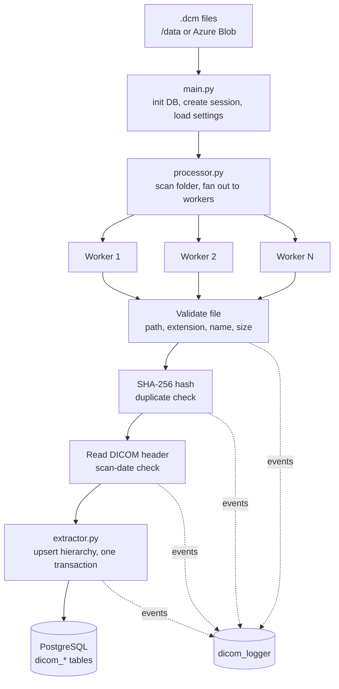
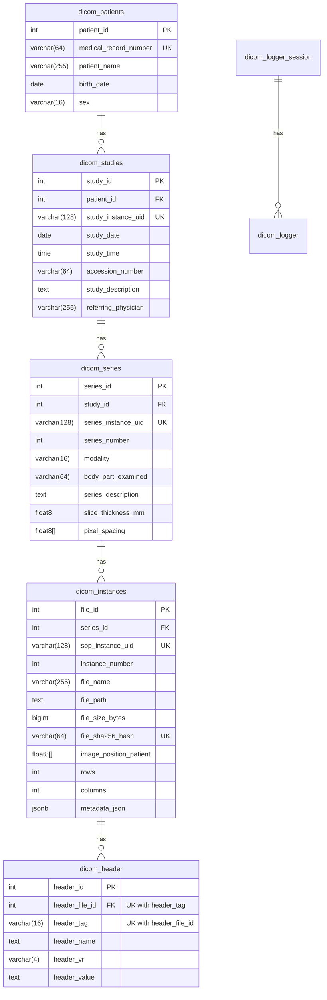

# DICOM Clinical Data ETL Pipeline


A containerized Python ETL pipeline that ingests DICOM medical files, validates them, extracts their complete metadata hierarchy, and loads everything into a normalized PostgreSQL database that follows the DICOM hierarchy (Patient → Study → Series → Instance), using parallel workers, content-hash deduplication, and structured database logging.

---

## Table of contents

- [Features](#features)
- [Architecture](#architecture)
- [Database schema](#database-schema)
- [Tech stack](#tech-stack)
- [Getting started](#getting-started)
- [Configuration](#configuration)
- [How a file is processed](#how-a-file-is-processed)
- [Performance](#performance)
- [Testing and CI](#testing-and-ci)
- [Project structure](#project-structure)
- [Design decisions](#design-decisions)
- [Security and privacy](#security-and-privacy)
- [Author](#author)

---

## Features

| Area | What it does |
|---|---|
| **Parallel processing** | Files are processed concurrently with `ProcessPoolExecutor`. The worker count is configurable, with sequential fallback. 4 workers import about 4× faster than sequential ([benchmark](#performance)). |
| **Relational modelling** | Patient → Study → Series → Instance hierarchy, loaded with idempotent `INSERT ... ON CONFLICT` upserts. |
| **Complete header capture** | Every DICOM tag (except raw pixel data) is stored as `JSONB` for flexible queries, and as one row per tag for relational queries. Nested sequences are kept in full, binary values are summarised, and both use the DICOM JSON tag format (`00080060`). Bulk inserts use `execute_values`. |
| **Input validation** | Checks file extension, filename whitelist and size limits, then rejects scans whose own date (`StudyDate`) is too old or in the future. |
| **Path-traversal protection** | Paths are resolved with `realpath` and `commonpath`, so `..` and symlink escapes outside the base folder are rejected. |
| **Duplicate prevention** | SHA-256 content hashing, and unique constraints on DICOM UIDs. |
| **Transactional safety** | Each file is one transaction. A failure at any step rolls back the whole patient → instance chain. |
| **Structured logging** | Console and critical-file logging, plus per-session, per-file event rows in PostgreSQL (module, function, line, process, thread, exception type, stack trace). |
| **Runtime configuration** | Import limits and worker count are read from the `dicom_settings` table, so no redeploy is needed to tune them. |
| **Cloud ingestion** | Optionally downloads `.dcm` files from Azure Blob Storage before processing. |
| **Profiling** | Opt-in `@Profiler` decorator (via `line_profiler`). Off by default with zero overhead; set `DICOM_PROFILE=1` to write line-by-line timings to one `profiler_logs_<pid>.txt` per process. |
| **Containerized** | Docker Compose runs PostgreSQL 15 with a health check, and the pipeline starts only once the database is ready. The pipeline image is a multi-stage build (no compiler in the final image) and runs as a non-root user. |

---

## Architecture



---

## Database schema



`UK` marks columns with a `UNIQUE` constraint; `(header_file_id, header_tag)` is unique as a pair. Supporting tables: `dicom_settings` (key/value runtime settings), `dicom_logger_session` (one row per run, with machine ID) and `dicom_logger` (one row per logged event).

**Example queries**

```sql
-- All CT series for a patient
SELECT s.series_description, s.slice_thickness_mm
FROM dicom_patients p
JOIN dicom_studies st ON st.patient_id = p.patient_id
JOIN dicom_series  s  ON s.study_id = st.study_id
WHERE p.medical_record_number = 'MRN001' AND s.modality = 'CT';

-- Search the full header as JSONB (tag 00080060 = Modality)
SELECT file_name
FROM dicom_instances
WHERE metadata_json -> '00080060' ->> 'value' = 'CT';

-- The same tag in the per-tag table (both use the same tag keys)
SELECT i.file_name, h.header_value
FROM dicom_header h
JOIN dicom_instances i ON i.file_id = h.header_file_id
WHERE h.header_tag = '00080060';

-- Import errors for the latest session
SELECT log_timestamp, log_level, log_dicomfile, log_message
FROM dicom_logger
WHERE log_logses_id = (SELECT max(logses_id) FROM dicom_logger_session)
  AND log_level IN ('ERROR', 'CRITICAL');
```

---

## Tech stack

Python 3.11 · PostgreSQL 15 · pydicom · psycopg2 · Docker / Docker Compose · Azure Blob Storage · pytest · GitHub Actions · line_profiler

---

## Getting started

### Prerequisites

- Docker and Docker Compose (recommended), **or** Python 3.10+ and a PostgreSQL instance
- Nothing else: five de-identified sample files are included in [`samples/`](samples/)

### 1. Clone and configure

```bash
git clone https://github.com/vybezy/dcm-data-etl.git
cd dcm-data-etl
```

Copy the template. Its development defaults work as they are, and `.env` is git-ignored:

```bash
cp .env.example .env
```

To download source files from Azure Blob Storage (container `raw-dicom-files`), set `AZURE_STORAGE_CONNECTION_STRING` in `.env`.

### 2. Add data

Copy the bundled samples into `./data`, or put your own `.dcm` files there:

```bash
cp samples/*.dcm data/          # Windows PowerShell: Copy-Item samples\*.dcm data\
```

The samples are five CT slices from the public LIDC-IDRI collection (CC BY 3.0); see [`samples/README.md`](samples/README.md) for the source and citation.

### 3. Run with Docker (recommended)

```bash
docker compose up --build
```

PostgreSQL is exposed on host port `5433`. Inside Compose, the pipeline overrides `DB_HOST` to `db` automatically and waits for the database health check before starting.

### Run locally without Docker

```bash
python -m venv .venv
source .venv/bin/activate        # Windows: .venv\Scripts\activate
pip install -r requirements.txt       # runtime only; use requirements-dev.txt to also run the tests
python main.py
```

### Command-line options

```bash
python main.py [PATH] [--workers N] [--dry-run] [--reset] [--no-azure]
```

| Option | Meaning |
|---|---|
| `PATH` | A folder, a single `.dcm` file or a wildcard such as `"./data/*.dcm"`. Defaults to `/data` in Docker, otherwise `./data`. |
| `--workers N` | Parallel worker processes (`0` = sequential). Overrides the `workers` setting in the database. |
| `--dry-run` | Run every validation and duplicate check without inserting anything. |
| `--reset` | Drop and recreate all pipeline tables first. **Deletes all imported data.** |
| `--no-azure` | Skip the Azure Blob Storage download even if a connection string is set. |

Data is kept between runs by default, so re-running the pipeline on the same folder reports the already-imported files as `duplicate` instead of inserting them again.

The process exits with `0` when no file errored, `1` when at least one file errored, and `2` when the input path does not exist. This makes it easy to use in scripts and CI.

### Profiling

Line-by-line profiling is off by default. To profile a run, install the development dependencies (which include `line_profiler`) and set `DICOM_PROFILE=1`:

```bash
pip install -r requirements-dev.txt
DICOM_PROFILE=1 python main.py ./data --workers 0     # Windows PowerShell: $env:DICOM_PROFILE=1; python main.py ./data --workers 0
```

Each process writes its timings to its own `profiler_logs_<pid>.txt`. Running with `--workers 0` keeps everything in one file.

---

## Configuration

Import behaviour is tunable at runtime through the `dicom_settings` table:

| Key | Default | Meaning |
|---|---|---|
| `min_file_size` | 100 KB | Smaller files are rejected |
| `max_file_size` | 99 MB | Larger files are rejected |
| `max_file_age_months` | 1200 | Scans older than this are rejected, judged by the DICOM `StudyDate` (falling back to `SeriesDate`, `AcquisitionDate`, `ContentDate`), not by the file's timestamp on disk |
| `workers` | 4 | Parallel worker processes (`0` = sequential) |

To start from empty tables, run with `--reset` or set `RESET_TABLES=true` in `.env`; either one drops and recreates all pipeline tables before the import, so set it back to `false` afterwards.

The defaults are defined once, in `DEFAULT_SETTINGS` in `config.py`. They are written to the table on first run and never overwrite a value you have changed.

Every file ends in exactly one status, summarized at the end of each run:

`inserted` · `duplicate` · `invalid` · `skipped` · `dry_run` · `error`

---

## How a file is processed

1. **Path check:** resolve the real path and confirm it is inside the base folder.
2. **Filename and extension:** must end in `.dcm` and match the filename whitelist.
3. **Size:** must be within the configured limits.
4. **Hash and duplicate check:** compute SHA-256 and look it up in `dicom_instances`.
5. **Header and scan date:** read the DICOM header once (pixel data skipped) and reject the file if its `StudyDate` is older than `max_file_age_months` or more than a day in the future. Files with no date at all are accepted with a warning. `--dry-run` stops after this step.
6. **Extraction (one transaction):** upsert patient → study → series, insert the instance, then bulk-insert all header tags.
7. **Commit or roll back:** success commits and logs `SUCCESS`. Any error rolls back the entire file, so no partial hierarchy is left behind.

Each step logs to the console and, when a session exists, to `dicom_logger`.

---

## Performance

Measured with [`benchmark.py`](benchmark.py): the 78 CT slices of the full sample series (about 40 MB) are imported from an empty database for each worker count, and each value is the median of 3 runs.

Environment: Docker Desktop on Windows, 12 logical CPU cores visible to the container, Python 3.11, PostgreSQL 15 in a second container.

| Workers | Time (s) | Files/sec | Speed-up |
|---|---|---|---|
| 0 (sequential) | 5.47 | 14.3 | 1.00x |
| 1 | 5.93 | 13.1 | 0.92x |
| 2 | 2.40 | 32.5 | 2.28x |
| 4 | 1.33 | 58.7 | 4.12x |
| 8 | 1.49 | 52.5 | 3.68x |

What the numbers show:

- **Parallelism pays off up to 4 workers.** 4 workers import 4.1× faster than a sequential run (58.7 vs 14.3 files per second). A speed-up slightly above the worker count is possible because a sequential import spends much of its time waiting on the database (connecting and committing once per file); with several workers those waits overlap.
- **1 worker is slower than sequential.** It does the same work plus the cost of starting a worker process and sending each task to it.
- **8 workers are slower than 4**, even with 12 cores available. The bottleneck moves from Python to the database. All 78 slices belong to the same patient, study and series, so every file's transaction upserts the same three rows, and PostgreSQL keeps a row updated by `INSERT ... ON CONFLICT DO UPDATE` locked until that transaction commits. Concurrent workers therefore queue on those rows, and all of them share one database and its commit log.
- **Small batch, some noise.** With 78 files, fixed costs such as starting processes are a noticeable share of the total, and single runs varied by up to about a second, which is why medians are reported.

To reproduce (this resets the pipeline tables before every run):

```bash
docker compose run --rm etl_pipeline python benchmark.py
```

Ideas for scaling further: reuse one database connection per worker instead of one per file, and batch several files per transaction. A dataset spread over many patients and series would also reduce the row-lock contention seen here.

---

## Testing and CI

```bash
pip install -r requirements-dev.txt
python -m pytest -v
```

Dependencies are split in two pinned files: `requirements.txt` holds only what the pipeline needs to run (and is all the Docker image installs), and `requirements-dev.txt` adds the test and profiling tools on top of it.

All suites live in [`tests/`](tests/):

| Suite | What it covers | Needs a database |
|---|---|---|
| `test_main.py` | Command-line options, folder / file / wildcard input, exit codes, `--reset`, settings fallback | No (mocked) |
| `test_processor.py` | Filename validation, path-traversal and symlink protection, hashing, every validation rejection, scan-date checks, duplicate, dry-run, rollback and error paths | No (mocked) |
| `test_extractor.py` | Date/time parsing, tag cleaning, nested sequences, binary values, JSON serialization, header bulk-insert payload, patient and study upserts | No (mocked) |
| `test_database.py` | Connections are always committed or rolled back and closed; session creation; settings loading; DB event logging | No (mocked) |
| `test_logger.py` | Plain-text labels, Unicode-safe console output, UTF-8 log file | No |
| `test_profiler.py` | Profiler is off by default and falls back cleanly without `line_profiler` | No |
| `test_azure.py` | Azure Blob download: skipped without a connection string, failures logged, existing files kept | No (mocked) |
| `test_benchmark.py` | Benchmark maths (median, files/sec, speed-up), `.dcm` counting, stopping on a failed import | No (mocked) |
| `test_integration.py` | Real DICOM files into real PostgreSQL: full hierarchy, JSONB, deduplication, upsert sharing, transaction rollback, DB event logging, scan-date rejection, schema indexes, multi-process import | Yes |

### Running the integration tests locally

The integration tests wipe the tables, so they only run when `TEST_DB_NAME` is set and contains `test`. Otherwise they are skipped.

```bash
docker run -d --name dcm_test_db \
  -e POSTGRES_PASSWORD=postgres -e POSTGRES_DB=dicom_test \
  -p 5434:5432 postgres:15

export TEST_DB_NAME=dicom_test TEST_DB_USER=postgres \
       TEST_DB_PASSWORD=postgres TEST_DB_PORT=5434
python -m pytest -v
```

### Continuous integration

GitHub Actions (`.github/workflows/ci.yml`) runs on every push. It starts a PostgreSQL 15 service container, installs the dependencies from `requirements-dev.txt` and runs the full suite, including the integration tests.

---

## Project structure

```
.
├── .github/workflows/ci.yml   # CI: PostgreSQL service + pytest
├── data/                      # input .dcm files
├── samples/                   # 5 sample .dcm files
├── tests/                     # unit and integration tests (pytest)
├── main.py                    # entry point: command-line options, init DB, build options
├── processor.py               # validation, hashing, dedupe, scan-date check, parallel orchestration
├── extractor.py               # DICOM value conversion and hierarchical upserts
├── database.py                # connection handling, sessions, DB event logging, settings
├── db_init.py                 # schema creation and reset
├── config.py                  # database credentials from .env and DEFAULT_SETTINGS
├── logger.py                  # console and file logging, pretty_log
├── utils.py                   # ImportOptions, Profiler, exception handler, Azure download
├── benchmark.py               # import speed for different worker counts
├── .env.example               # template for .env
├── .dockerignore              # keeps .env and data out of the Docker image
├── Dockerfile                 # multi-stage build, runs as non-root user
├── docker-compose.yml
├── requirements.txt           # pinned runtime dependencies (installed in the Docker image)
└── requirements-dev.txt       # runtime dependencies + pytest and line_profiler
```

---

## Design decisions

- **Process pool instead of threads.** Parsing and hashing are CPU-bound, so separate processes avoid the GIL. Each worker opens its own database connection, so no connections are shared across processes.
- **One transaction per file.** The hierarchy is written all-or-nothing, which keeps the database consistent even when a single file is malformed.
- **Upserts instead of check-then-insert.** `ON CONFLICT` on the DICOM UIDs makes the pipeline idempotent and safe under concurrent workers.
- **No duplicate indexes.** PostgreSQL already builds an index for every `UNIQUE` constraint (patient MRN, study/series UIDs, SHA-256 hash, and `(header_file_id, header_tag)`), so the schema adds explicit indexes only on columns that are not already covered, such as foreign keys, modality, tag and the `JSONB` GIN index. This avoids paying for the same index twice on every insert.
- **`JSONB` plus a per-tag table.** `JSONB` serves flexible whole-header queries, while `dicom_header` supports indexed relational lookups by tag.
- **Settings in the database.** Operators can tune limits and parallelism without rebuilding the image.
- **Logs in the database.** Per-session, per-file event rows make an import auditable and queryable with plain SQL.

---

## Security and privacy

DICOM files can contain protected health information (PHI), so the project treats data handling as part of the design.

- **Sample data is de-identified.** The files in `samples/` come from the public LIDC-IDRI collection and were de-identified by the publisher: names, birth dates and referring physicians are empty, and `PatientIdentityRemoved` is `YES`.
- **Know where PHI would land.** With real clinical data, `dicom_patients` (name, birth date, medical record number), `dicom_studies` (referring physician, accession number), and the full header in `dicom_instances.metadata_json` and `dicom_header` would hold identifying information.
- **Real patient data is out of scope as-is.** The pipeline does not de-identify files itself. Real patient data should be de-identified before import, or the database protected with encryption, access control and auditing appropriate to the applicable regulations (for example HIPAA or GDPR). This project makes no compliance claims.
- **Secrets stay out of git.** Credentials live in a git-ignored `.env`; the repository only ships `.env.example` with local development values, and `.dockerignore` keeps `.env` out of the Docker image.
- **Untrusted file paths are contained.** Every input path is resolved with `realpath` and must stay inside the base folder, so `..` tricks and symlinks cannot reach other files. Filenames are restricted to letters, digits, `_`, `-`, `.` and spaces.
- **No SQL injection from file contents.** Every value read from a DICOM file or setting is passed with psycopg2 parameter binding; the pipeline never builds SQL with string formatting.

---

## Author

Developed by **Maria Marini**.
