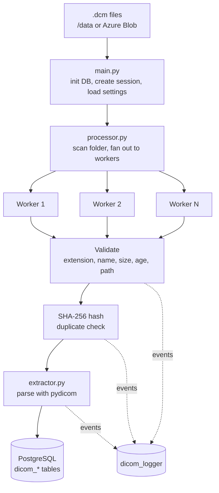
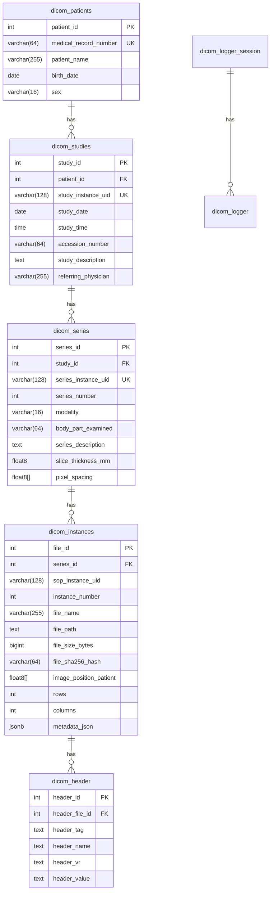

# DICOM Clinical Data ETL Pipeline


A containerized Python ETL pipeline that ingests DICOM medical files, validates them, extracts their complete metadata hierarchy, and loads everything into a normalized PostgreSQL database that follows the DICOM standard (Patient -> Study -> Series), using parallel workers, content-hash deduplication, and structured database logging.

---

## Table of contents

- [Features](#features)
- [Architecture](#architecture)
- [Database schema](#database-schema)
- [Tech stack](#tech-stack)
- [Getting started](#getting-started)
- [Configuration](#configuration)
- [How a file is processed](#how-a-file-is-processed)
- [Testing and CI](#testing-and-ci)
- [Project structure](#project-structure)
- [Design decisions](#design-decisions)
- [Security and privacy](#security-and-privacy)
- [Author](#author)

---

## Features

| Area | What it does |
|---|---|
| **Parallel processing** | Files are processed concurrently with `ProcessPoolExecutor`. The worker count is configurable, with sequential fallback. |
| **Relational modelling** | Patient → Study → Series Instance hierarchy, loaded with idempotent `INSERT ... ON CONFLICT` upserts. |
| **Complete header capture** | Every DICOM tag (except raw pixel data) is stored as `JSONB` for flexible queries, and as one row per tag for relational queries. Bulk inserts use `execute_values`. |
| **Input validation** | Checks file extension, filename whitelist and size limits, then rejects scans whose own date (`StudyDate`) is too old or in the future. |
| **Path-traversal protection** | Paths are resolved with `realpath` and `commonpath`, so `..` and symlink escapes outside the base folder are rejected. |
| **Duplicate prevention** | SHA-256 content hashing, and unique constraints on DICOM UIDs. |
| **Transactional safety** | Each file is one transaction. A failure at any step rolls back the whole patient → instance chain. |
| **Structured logging** | Console and critical-file logging, plus per-session, per-file event rows in PostgreSQL (module, function, line, process, thread, exception type, stack trace). |
| **Runtime configuration** | Import limits and worker count are read from the `dicom_settings` table, so no redeploy is needed to tune them. |
| **Cloud ingestion** | Optionally downloads `.dcm` files from Azure Blob Storage before processing. |
| **Profiling** | Opt-in `@Profiler` decorator (via `line_profiler`). Off by default with zero overhead; set `DICOM_PROFILE=1` to write line-by-line timings to one `profiler_logs_<pid>.txt` per process. |
| **Containerized** | Docker Compose runs PostgreSQL 15 with a health check, and the pipeline starts only once the database is ready. |

---

## Architecture



---

## Database schema



Supporting tables: `dicom_settings` (key/value runtime settings), `dicom_logger_session` (one row per run, with machine ID) and `dicom_logger` (one row per logged event).

**Example queries**

```sql
-- All CT series for a patient
SELECT s.series_description, s.slice_thickness_mm
FROM dicom_patients p
JOIN dicom_studies st ON st.patient_id = p.patient_id
JOIN dicom_series  s  ON s.study_id = st.study_id
WHERE p.medical_record_number = 'MRN001' AND s.modality = 'CT';

-- Search the full header as JSONB (tag 0008,0060 = Modality)
SELECT file_name
FROM dicom_instances
WHERE metadata_json -> '00080060' ->> 'value' = 'CT';

-- Import errors for the latest session
SELECT log_timestamp, log_level, log_dicomfile, log_message
FROM dicom_logger
WHERE log_logses_id = (SELECT max(logses_id) FROM dicom_logger_session)
  AND log_level IN ('ERROR', 'CRITICAL');
```

---

## Tech stack

Python 3.11 · PostgreSQL 15 · pydicom · psycopg2 · Docker / Docker Compose · Azure Blob Storage · pytest · GitHub Actions · line_profiler

---

## Getting started

### Prerequisites

- Docker and Docker Compose (recommended), **or** Python 3.10+ and a PostgreSQL instance
- Some `.dcm` files to import (included in the "samples" file)

### 1. Clone and configure

```bash
git clone https://github.com/USER/REPO.git
cd REPO
```

Copy the template. Its development defaults work as they are, and `.env` is git-ignored:

```bash
cp .env.example .env
```

To download source files from Azure Blob Storage (container `raw-dicom-files`), set `AZURE_STORAGE_CONNECTION_STRING` in `.env`.

### 2. Add data

Place `.dcm` files in `./data`.

### 3. Run with Docker (recommended)

```bash
docker compose up --build
```

PostgreSQL is exposed on host port `5433`. Inside Compose, the pipeline overrides `DB_HOST` to `db` automatically and waits for the database health check before starting.

### Run locally without Docker

```bash
python -m venv .venv
source .venv/bin/activate        # Windows: .venv\Scripts\activate
pip install -r requirements.txt
python main.py
```

### Command-line options

```bash
python main.py [PATH] [--workers N] [--dry-run] [--reset] [--no-azure]
```

| Option | Meaning |
|---|---|
| `PATH` | A folder, a single `.dcm` file or a wildcard such as `"./data/*.dcm"`. Defaults to `/data` in Docker, otherwise `./data`. |
| `--workers N` | Parallel worker processes (`0` = sequential). Overrides the `workers` setting in the database. |
| `--dry-run` | Run every validation and duplicate check without inserting anything. |
| `--reset` | Drop and recreate all pipeline tables first. **Deletes all imported data.** |
| `--no-azure` | Skip the Azure Blob Storage download even if a connection string is set. |

Data is kept between runs by default, so re-running the pipeline on the same folder reports the already-imported files as `duplicate` instead of inserting them again.

The process exits with `0` when no file errored, `1` when at least one file errored, and `2` when the input path does not exist. This makes it easy to use in scripts and CI.

### Profiling

Line-by-line profiling is off by default. To profile a run, install `line_profiler` and set `DICOM_PROFILE=1`:

```bash
pip install line_profiler
DICOM_PROFILE=1 python main.py ./data --workers 0     # Windows PowerShell: $env:DICOM_PROFILE=1; python main.py ./data --workers 0
```

Each process writes its timings to its own `profiler_logs_<pid>.txt`. Running with `--workers 0` keeps everything in one file.

---

## Configuration

Import behaviour is tunable at runtime through the `dicom_settings` table:

| Key | Default | Meaning |
|---|---|---|
| `min_file_size` | 100 KB | Smaller files are rejected |
| `max_file_size` | 99 MB | Larger files are rejected |
| `max_file_age_months` | 1200 | Scans older than this are rejected, judged by the DICOM `StudyDate` (falling back to `SeriesDate`, `AcquisitionDate`, `ContentDate`), not by the file's timestamp on disk |
| `workers` | 4 | Parallel worker processes (`0` = sequential) |
| `subject_min_length` | 2 | Minimum subject length |
| `safe_dicom_folder` | empty | Reserved for a safe-folder path |

The defaults are defined once, in `DEFAULT_SETTINGS` in `config.py`. They are written to the table on first run and never overwrite a value you have changed.

Every file ends in exactly one status, summarized at the end of each run:

`inserted` · `duplicate` · `invalid` · `skipped` · `dry_run` · `error`

---

## How a file is processed

1. **Path check:** resolve the real path and confirm it is inside the base folder.
2. **Filename and extension:** must end in `.dcm` and match the filename whitelist.
3. **Size:** must be within the configured limits.
4. **Hash and duplicate check:** compute SHA-256 and look it up in `dicom_instances`.
5. **Header and scan date:** read the DICOM header once (pixel data skipped) and reject the file if its `StudyDate` is older than `max_file_age_months` or more than a day in the future. Files with no date at all are accepted with a warning. `--dry-run` stops after this step.
6. **Extraction (one transaction):** upsert patient → study → series, insert the instance, then bulk-insert all header tags.
7. **Commit or roll back:** success commits and logs `SUCCESS`. Any error rolls back the entire file, so no partial hierarchy is left behind.

Each step logs to the console and, when a session exists, to `dicom_logger`.

---

## Testing and CI

```bash
pip install pytest
python -m pytest -v
```

| Suite | What it covers | Needs a database |
|---|---|---|
| `test_extractor.py` | Tag cleaning, JSON serialization, header bulk-insert payload, patient and study upserts | No (mocked) |
| `test_processor.py` | Filename validation, path-traversal and symlink protection, hashing, every validation rejection, duplicate, dry-run, rollback and error paths | No (mocked) |
| `test_integration.py` | Real DICOM files into real PostgreSQL: full hierarchy, JSONB, deduplication, upsert sharing, transaction rollback, DB event logging, multi-process import | Yes |

### Running the integration tests locally

The integration tests wipe the tables, so they only run when `TEST_DB_NAME` is set and contains `test`. Otherwise they are skipped.

```bash
docker run -d --name dcm_test_db \
  -e POSTGRES_PASSWORD=postgres -e POSTGRES_DB=dicom_test \
  -p 5434:5432 postgres:15

export TEST_DB_NAME=dicom_test TEST_DB_USER=postgres \
       TEST_DB_PASSWORD=postgres TEST_DB_PORT=5434
python -m pytest -v
```

### Continuous integration

GitHub Actions (`.github/workflows/ci.yml`) runs on every push. It starts a PostgreSQL 15 service container, installs the dependencies from `requirements.txt` and runs the full suite, including the integration tests.

---

## Project structure

```
.
├── .github/workflows/ci.yml   # CI: PostgreSQL service + pytest
├── data/                      # input .dcm files (not committed)
├── main.py                    # entry point: resolve input, init DB, build options
├── processor.py               # validation, hashing, dedupe, parallel orchestration
├── extractor.py               # pydicom parsing and hierarchical upserts
├── database.py                # sessions, DB event logging, settings
├── db_init.py                 # schema creation / reset
├── config.py                  # credentials from .env
├── logger.py                  # console/file logging, pretty_log
├── utils.py                   # ImportOptions, Profiler, exception handler, Azure download
├── test_extractor.py
├── test_processor.py
├── test_integration.py
├── Dockerfile
├── docker-compose.yml
└── requirements.txt
```

---

## Design decisions

- **Process pool instead of threads.** Parsing and hashing are CPU-bound, so separate processes avoid the GIL. Each worker opens its own database connection, so no connections are shared across processes.
- **One transaction per file.** The hierarchy is written all-or-nothing, which keeps the database consistent even when a single file is malformed.
- **Upserts instead of check-then-insert.** `ON CONFLICT` on the DICOM UIDs makes the pipeline idempotent and safe under concurrent workers.
- **No duplicate indexes.** PostgreSQL already builds an index for every `UNIQUE` constraint (patient MRN, study/series UIDs, SHA-256 hash, and `(header_file_id, header_tag)`), so the schema adds explicit indexes only on columns that are not already covered, such as foreign keys, modality, tag and the `JSONB` GIN index. This avoids paying for the same index twice on every insert.
- **`JSONB` plus a per-tag table.** `JSONB` serves flexible whole-header queries, while `dicom_header` supports indexed relational lookups by tag.
- **Settings in the database.** Operators can tune limits and parallelism without rebuilding the image.
- **Logs in the database.** Per-session, per-file event rows make an import auditable and queryable with plain SQL.

---

## Security and privacy

- The sample data provided is public data and anonymous.

---

## Author

Developed by **MARIA MARINI**
